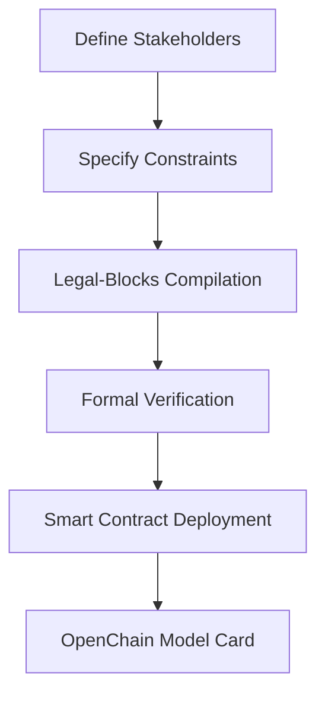
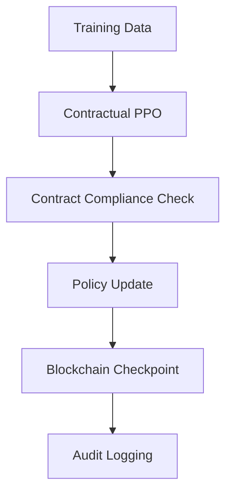
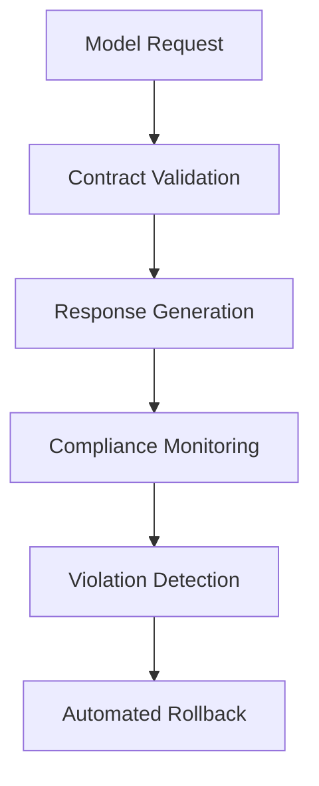

# RLHF-Contract-Wizard Architecture

## System Overview

RLHF-Contract-Wizard is a JAX-based library that enables encoding RLHF reward functions directly into legally-binding, machine-readable contracts. The system implements Stanford's 2025 "Legal-Blocks" specification for verifiable AI alignment.

## Core Components

### 1. Legal-Blocks Compiler
```
┌─────────────────┐     ┌──────────────┐     ┌─────────────┐
│ Reward Function │────▶│ Legal-Blocks │────▶│  OpenChain  │
│  Specification  │     │   Compiler   │     │ Model Card  │
└─────────────────┘     └──────────────┘     └─────────────┘
```

**Purpose**: Transforms high-level reward specifications into legally enforceable contracts.

**Key Interfaces**:
- `LegalBlocks.specification()` - Decorator for constraint definition
- `RewardContract.compile_to_openchain()` - OpenChain export
- `Verifier.prove()` - Formal verification interface

### 2. JAX Reward Engine
```
┌─────────────────┐     ┌──────────────┐     ┌─────────────┐
│   JAX Reward    │     │   Contract   │     │ Deployment  │
│     Model       │     │ Verification │     │ Enforcement │
└─────────────────┘     └──────────────┘     └─────────────┘
```

**Purpose**: High-performance reward computation with contract enforcement.

**Components**:
- `ContractualRewardModel` - Neural reward model with contract constraints
- `ContractualPPO` - PPO implementation with contract compliance
- `ComplianceMonitor` - Real-time violation detection

### 3. Blockchain Integration Layer

**Smart Contract Stack**:
```solidity
RLHFRewardContract
├── RewardFunction storage
├── Stakeholder management
├── Version control
└── Audit logging
```

**Python Integration**:
- `BlockchainContract` - Web3 integration
- `ModelCardGenerator` - OpenChain compliance
- `AuditLogger` - Tamper-proof logging

## Data Flow Architecture

### 1. Contract Definition Phase


### 2. Training Phase


### 3. Deployment Phase


## Component Dependencies

### Core Libraries
- **JAX 0.4.25+**: Numerical computation and automatic differentiation
- **Optax**: Optimization algorithms for PPO training
- **Flax**: Neural network layers and model definitions
- **Chex**: Testing and validation utilities

### Blockchain Stack
- **Web3.py**: Ethereum blockchain interaction
- **Solidity 0.8.20+**: Smart contract development
- **Hardhat**: Contract compilation and deployment
- **IPFS**: Distributed audit log storage

### Verification Engine
- **Z3**: SMT solver for formal verification
- **Lean 4**: Theorem proving backend (optional)
- **CBMC**: Bounded model checking

## Security Architecture

### 1. Multi-Layer Validation
```
┌─────────────────┐
│  Input Layer    │ ← Request sanitization
├─────────────────┤
│ Contract Layer  │ ← Constraint enforcement
├─────────────────┤
│ Model Layer     │ ← Response generation
├─────────────────┤
│ Compliance      │ ← Real-time monitoring
├─────────────────┤
│ Audit Layer     │ ← Immutable logging
└─────────────────┘
```

### 2. Threat Model
- **Adversarial Inputs**: Mitigated through constraint checking
- **Contract Manipulation**: Prevented via blockchain immutability
- **Model Drift**: Detected through continuous compliance monitoring
- **Stakeholder Collusion**: Addressed via cryptographic voting

### 3. Security Controls
- **Access Control**: Multi-signature stakeholder approval
- **Audit Trail**: IPFS-backed tamper-proof logging
- **Rollback Mechanism**: Automated safe-state restoration
- **Formal Verification**: Mathematical proof of safety properties

## Scalability Considerations

### Performance Characteristics
| Component | Latency | Throughput | Memory |
|-----------|---------|------------|--------|
| Contract Validation | <10ms | 10k req/s | 512MB |
| Reward Computation | <5ms | 20k req/s | 1GB |
| Blockchain Logging | 2-15s | 100 tx/s | 256MB |
| Formal Verification | 1-60s | N/A | 1-16GB |

### Optimization Strategies
- **Constraint Caching**: LRU cache for frequent evaluations
- **Batch Processing**: Vectorized JAX operations
- **Lazy Verification**: On-demand formal proof generation
- **Sharding**: Multi-chain deployment for high throughput

## Integration Patterns

### 1. Library Integration
```python
# Existing RLHF frameworks
from transformers import AutoModel
from trl import PPOTrainer

# RLHF-Contract-Wizard integration
from rlhf_contract import RewardContract, ContractualPPO

# Seamless adapter pattern
contract_ppo = ContractualPPO.from_standard_ppo(
    ppo_trainer=standard_ppo,
    contract=reward_contract
)
```

### 2. Microservice Architecture
```
┌─────────────────┐   ┌─────────────────┐   ┌─────────────────┐
│  Model Service  │──▶│ Contract Service│──▶│ Blockchain API  │
└─────────────────┘   └─────────────────┘   └─────────────────┘
         │                      │                      │
         ▼                      ▼                      ▼
┌─────────────────┐   ┌─────────────────┐   ┌─────────────────┐
│ Monitoring API  │   │ Verification    │   │   Audit Store   │
│                 │   │    Service      │   │                 │
└─────────────────┘   └─────────────────┘   └─────────────────┘
```

## Development Workflow

### 1. Contract Development Lifecycle
1. **Specification**: Define stakeholders and constraints
2. **Implementation**: Code reward functions and safety checks
3. **Verification**: Prove formal properties with Z3/Lean
4. **Testing**: Property-based and adversarial testing
5. **Deployment**: Smart contract deployment and monitoring
6. **Evolution**: Democratic contract amendments

### 2. Quality Gates
- **Unit Tests**: >95% code coverage
- **Integration Tests**: End-to-end contract scenarios
- **Property Tests**: Automated constraint verification
- **Security Audit**: Third-party contract review
- **Performance Benchmark**: <20% overhead requirement

### 3. Deployment Pipeline
```yaml
Development → Testing → Staging → Canary → Production
     ↓           ↓         ↓        ↓         ↓
 Unit Tests  Integration Stress  A/B Test  Monitor
 Property    Security    Load    Metrics   Alerts  
 Lint        Audit       Test    Compare   Rollback
```

## Extension Points

### 1. Custom Constraint Types
```python
@LegalBlocks.register_constraint_type
class CustomConstraint(BaseConstraint):
    def evaluate(self, context):
        # Custom logic
        pass
```

### 2. New Verification Backends
```python
@Verifier.register_backend("custom_solver")
class CustomVerifier(VerificationBackend):
    def prove_property(self, property_spec):
        # Custom verification logic
        pass
```

### 3. Alternative Blockchain Networks
```python
@BlockchainContract.register_network("polygon")
class PolygonContract(BaseBlockchainContract):
    def deploy_contract(self, spec):
        # Polygon-specific deployment
        pass
```

## Implementation Architecture

### Database Schema Design
```sql
-- Core contract storage
CREATE TABLE contracts (
    id UUID PRIMARY KEY,
    name VARCHAR(255) NOT NULL,
    version VARCHAR(50) NOT NULL,
    spec_hash VARCHAR(64) UNIQUE NOT NULL,
    metadata JSONB,
    created_at TIMESTAMP DEFAULT NOW(),
    updated_at TIMESTAMP DEFAULT NOW()
);

-- Stakeholder management
CREATE TABLE stakeholders (
    id UUID PRIMARY KEY,
    contract_id UUID REFERENCES contracts(id),
    name VARCHAR(255) NOT NULL,
    weight DECIMAL(10,6) NOT NULL,
    address VARCHAR(42),
    preferences JSONB
);

-- Constraint definitions
CREATE TABLE constraints (
    id UUID PRIMARY KEY,
    contract_id UUID REFERENCES contracts(id),
    name VARCHAR(255) NOT NULL,
    description TEXT,
    constraint_type VARCHAR(100),
    severity DECIMAL(3,2) DEFAULT 1.0,
    parameters JSONB
);

-- Deployment tracking
CREATE TABLE deployments (
    id UUID PRIMARY KEY,
    contract_id UUID REFERENCES contracts(id),
    network VARCHAR(50) NOT NULL,
    contract_address VARCHAR(42),
    transaction_hash VARCHAR(66),
    status VARCHAR(50) DEFAULT 'pending',
    deployed_at TIMESTAMP
);

-- Compliance monitoring
CREATE TABLE violations (
    id UUID PRIMARY KEY,
    contract_id UUID REFERENCES contracts(id),
    constraint_name VARCHAR(255),
    violation_data JSONB,
    severity DECIMAL(3,2),
    detected_at TIMESTAMP DEFAULT NOW(),
    resolved_at TIMESTAMP
);
```

### API Service Architecture
```python
# src/api/services/
├── contract_service.py      # Contract CRUD operations
├── verification_service.py  # Formal verification logic
├── blockchain_service.py    # Smart contract deployment
├── monitoring_service.py    # Real-time compliance monitoring
├── governance_service.py    # Stakeholder voting and amendments
└── audit_service.py        # Immutable audit trail management
```

### JAX Computation Pipeline
```python
# High-performance reward computation
@jax.jit
def compute_contract_reward(
    state: jnp.ndarray,
    action: jnp.ndarray,
    contract_params: ContractParams
) -> RewardOutput:
    # Vectorized stakeholder reward computation
    stakeholder_rewards = jax.vmap(
        lambda stakeholder: stakeholder.reward_fn(state, action)
    )(contract_params.stakeholders)
    
    # Constraint violation checking
    violations = jax.vmap(
        lambda constraint: constraint.check_fn(state, action)
    )(contract_params.constraints)
    
    # Aggregation with penalty application
    aggregated_reward = aggregate_stakeholder_rewards(
        stakeholder_rewards, 
        contract_params.weights
    )
    
    penalty = compute_violation_penalty(violations, contract_params.penalties)
    
    return RewardOutput(
        final_reward=aggregated_reward + penalty,
        stakeholder_breakdown=stakeholder_rewards,
        violations=violations,
        computation_metadata=get_computation_metadata()
    )
```

### Real-time Monitoring Architecture
```python
# src/monitoring/
├── compliance_monitor.py    # Real-time violation detection
├── metrics_collector.py     # Performance and usage metrics
├── alert_manager.py         # Stakeholder notifications
├── dashboard_service.py     # Real-time monitoring dashboard
└── incident_response.py     # Automated response to violations
```

## Future Architecture Evolution

### Planned Enhancements
1. **Zero-Knowledge Proofs**: Private contract verification
2. **Multi-Chain Support**: Cross-chain contract deployment
3. **Constitutional AI**: Integration with constitutional training methods
4. **Natural Language**: Specification from plain English
5. **Automated Negotiation**: AI-driven contract optimization

### Advanced Verification Pipeline
```python
# Future verification architecture
class AdvancedVerifier:
    def __init__(self):
        self.backends = {
            'z3': Z3Backend(),
            'lean4': Lean4Backend(),
            'coq': CoqBackend(),
            'dafny': DafnyBackend()
        }
        self.proof_cache = ProofCache()
        
    async def verify_contract(self, contract: RewardContract) -> VerificationResult:
        # Parallel verification across multiple backends
        tasks = [
            backend.verify_async(contract) 
            for backend in self.backends.values()
        ]
        results = await asyncio.gather(*tasks)
        
        # Consensus-based verification
        return self.consensus_verifier.aggregate_results(results)
```

### Scalability Roadmap
- **Phase 1**: Single-chain, single-model contracts (Current)
- **Phase 2**: Multi-stakeholder, multi-model systems (Q2 2025)
- **Phase 3**: Cross-chain, federated learning integration (Q3 2025)
- **Phase 4**: Autonomous contract evolution and optimization (Q4 2025)

### Microservices Decomposition
```yaml
# Kubernetes deployment architecture
services:
  contract-api:
    replicas: 3
    resources: { cpu: "2", memory: "4Gi" }
    
  verification-service:
    replicas: 2
    resources: { cpu: "8", memory: "16Gi" }
    
  blockchain-service:
    replicas: 2
    resources: { cpu: "1", memory: "2Gi" }
    
  monitoring-service:
    replicas: 3
    resources: { cpu: "2", memory: "4Gi" }
    
  database:
    type: "PostgreSQL"
    replicas: 3
    resources: { cpu: "4", memory: "8Gi" }
    
  cache:
    type: "Redis"
    replicas: 3
    resources: { cpu: "1", memory: "4Gi" }
```